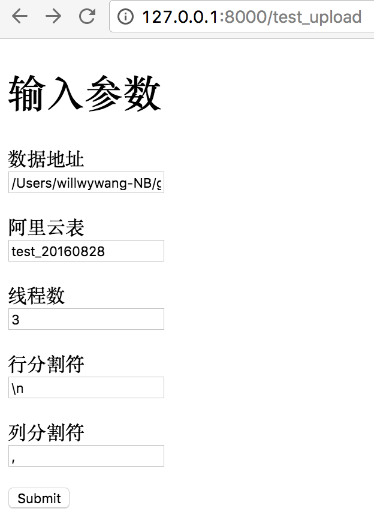
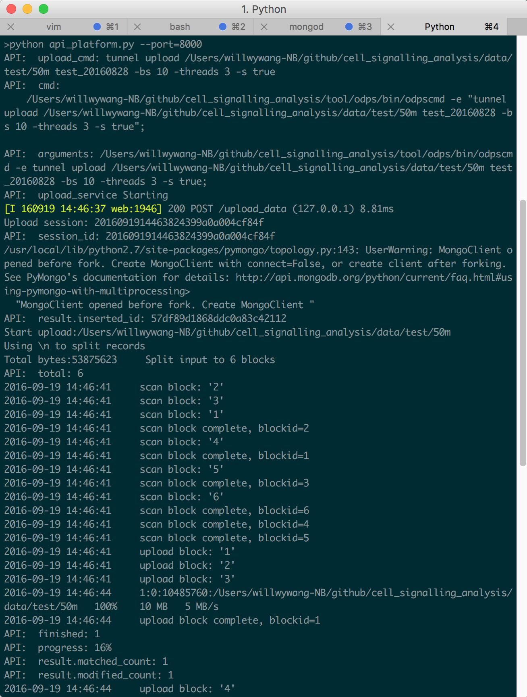

# API list

## 上传

### /upload_data

上传数据

参数:
1. data_path
2. aliyun_table
3. threads_num
4. row_delimiter
5. col_delimiter
6. project_id

**测试页面**

**后端demo**

### /request_upload_progress

查看上传进度

### /requet_upload_stat

获取原上传后数据的统计信息

## 去重

### /deduplication_data

启动数据去重

### /request_deduplication_progress

查看去重进度

### /requet_deduplication_stat

获取去重数据的统计信息

## 过滤

### /filter_data

启动数据过滤

### /request_filter_progress

查看过滤进度

### /requet_filter_stat

获取过滤数据的统计信息

## 分区

### /partition_data

创建根据日期的分区表

### /request_partition_progress

查看分区进度

### /requet_partition_stat

获取分区数据的统计信息

## 人口统计 

### /demographic

启动计算每个人的数据条数等

### /request_demographic_progress

查看进度

### /request_demographic_stat

获取人口统计信息

## 基站信息

### /basestation

启动基站信息抽取

### /request_basestation_progress

查看进度

### /request_station_stat

获取基站统计信息

## 天粒度基站热力

### /base_station_summary

启动天粒度基站热力

### /request_base_station_summary_progress

天粒度基站热力进度

### /request_base_station_summary_stat

获取天粒度基站热力统计

### /get_base_station_summary

获取天粒度基站热力进度

## 小时粒度基站热力

### /base_station_hour_summary

启动天粒度基站热力

### /request_base_station_hour_summary_progress

天粒度基站热力进度

### /request_base_station_hour_summary_stat

获取天粒度基站热力统计

### /get_base_station_hour_summary

获取天粒度基站热力进度

## 最细粒度人时空信息表

### /uuid_cell_hours

启动计算人的时空聚合信息

### /request_uuid_cell_hours_progress

查看进度

### /request_uuid_cell_hours_stat

获取人的时空信息统计
