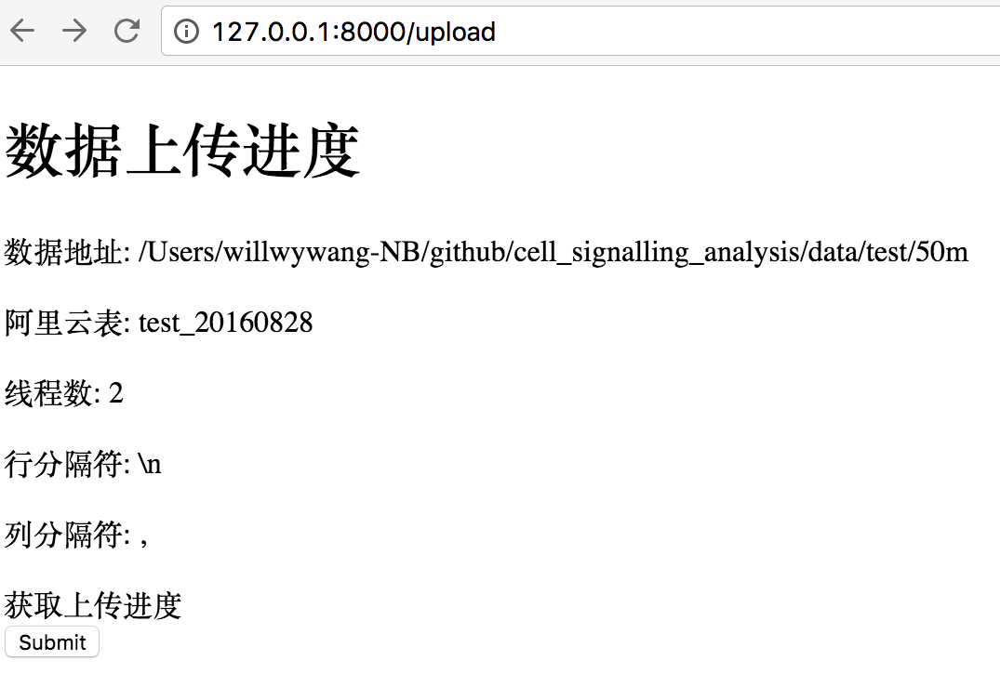

<!-- toc orderedList:0 -->

- [api平台demo](#api平台demo)
	- [基于tornado](#基于tornado)
	- [命令行执行方法](#命令行执行方法)
	- [通过api调用命令行](#通过api调用命令行)
		- [api输入参数:](#api输入参数)
			- [数据地址:](#数据地址)
			- [目标表:](#目标表)
			- [线程数:](#线程数)
			- [行分隔符:](#行分隔符)
			- [列分隔符:](#列分隔符)
			- [隐藏了的参数:](#隐藏了的参数)
		- [api使用post形式提交](#api使用post形式提交)
			- [上传时的日志样本](#上传时的日志样本)
	- [存储上传进度](#存储上传进度)
		- [任务进度表结构](#任务进度表结构)
		- [mongodb基本](#mongodb基本)
			- [安装方法](#安装方法)
			- [启动](#启动)
		- [进度的存储](#进度的存储)
		- [进度获取](#进度获取)

<!-- tocstop -->

# api平台demo

## 基于tornado
使用python语言的tornado作为api server的平台

## 命令行执行方法

上传原始数据:
`python test_cmd.py cmd/upload.cmd`

执行sql:
`python test_cmd.py cmd/limit3.sql`

test_cmd.py代码:

```python
import subprocess
import shlex
import sys

def runProcess(exe):
    p = subprocess.Popen(exe, stdout=subprocess.PIPE, stderr=subprocess.STDOUT)
    while(True):
      retcode = p.poll() #returns None while subprocess is running
      line = p.stdout.readline()
      yield line
      if(retcode is not None):
        break
    print "\nFinish process"

# Make it configable
client = "tool/odps/bin/odpscmd"

file_name = sys.argv[1]

# use sql file
cmd = """
%s -f "%s";
""" % (client, file_name)

print "cmd: ",cmd
args =  shlex.split(cmd)
print "args: ",args

for line in runProcess(args):
    print line,
```

## 通过api调用命令行

### api输入参数:

暴露出来如下参数, 其余的使用内置参数(为了尽可能简单)

#### 数据地址:
例如:  
data/test/50m  

注意事项:  
数据是已经按照指定格式处理过的, 列数要跟创建的阿里云表一致。

#### 目标表:
例如: test_20160828

#### 线程数:
例如: 8

#### 行分隔符:
例如: "\n"

#### 列分隔符:
例如: ","

#### 隐藏了的参数:
1. -bs <ARG>: block大小, 单位MB, 默认100
2. -c <ARG>: 设置file的编码格式, **默认不改变编码, 使用raw**
3. -cp <ARG>: 压缩, 默认true
4. -dbr <ARG>: 是否丢弃异常数据, 默认false
5. -dfp <ARG>: 设置日期格式, 默认"yyyy-MM-dd HH:mm:ss"
7. -h <ARG>: 是否有表头, 默认false
8. -mbr <ARG>: 最多允许多少条异常数据, 默认1000
9. -ni <ARG>: 设置null表示成的字符串, 默认""
11. -s <ARG>: 是否先扫描文件再上传, 默认true, only时只扫描
12. -sd <ARG>: 设置session目录, 默认null, **作用?**
13. -te <ARG>: 设置tunnel endpoint
15. -tz <ARG>: 设置时区, 默认本地Asia/Shanghai

### api使用post形式提交

后台测试期间, 前端我简单的设计一个提交窗口用于输入参数


点击submit后调用api, 启动数据上传, 测试期间跳转到这个页面, 通过点击获取上传进度从数据库中拉取当前的上传进度。api启动的上传会将最新的进展存到数据库中。



#### 上传时的日志样本

上传时的日志, 关键信息如下。
抽取`Total bytes:323253738  	 Split input to 11 blocks`得到总共block个数: **total**  
抽取`upload block complete, blockid=1`得到当前处理了几个block:  **current**
进度估算: **current/total**


```
Upload session: 201609171935416b399a0a0045cc40
Start upload:data/test/300m
Using \n to split records
Total bytes:323253738  	 Split input to 11 blocks
2016-09-17 19:35:42    	scan block: '1'
2016-09-17 19:35:42    	scan block: '2'
2016-09-17 19:35:43    	scan block complete, blockid=1
2016-09-17 19:35:43    	scan block: '3'
2016-09-17 19:35:43    	scan block complete, blockid=2
2016-09-17 19:35:43    	scan block: '4'
2016-09-17 19:35:43    	scan block complete, blockid=3
2016-09-17 19:35:43    	scan block: '5'
2016-09-17 19:35:43    	scan block complete, blockid=4
2016-09-17 19:35:43    	scan block: '6'
2016-09-17 19:35:44    	scan block complete, blockid=5
2016-09-17 19:35:44    	scan block: '7'
2016-09-17 19:35:44    	scan block complete, blockid=6
2016-09-17 19:35:44    	scan block: '8'
2016-09-17 19:35:44    	scan block complete, blockid=7
2016-09-17 19:35:44    	scan block: '9'
2016-09-17 19:35:44    	scan block complete, blockid=8
2016-09-17 19:35:44    	scan block: '10'
2016-09-17 19:35:45    	scan block complete, blockid=9
2016-09-17 19:35:45    	scan block: '11'
2016-09-17 19:35:45    	scan block complete, blockid=10
2016-09-17 19:35:45    	scan block complete, blockid=11
2016-09-17 19:35:45    	upload block: '1'
2016-09-17 19:35:45    	upload block: '2'
2016-09-17 19:35:51    	1:0:31457280:data/test/300m       	18%    	5.4 MB 	1.1 MB/s
2016-09-17 19:35:51    	2:31457280:31457280:data/test/300m	13%    	4 MB   	826.7 KB/s
2016-09-17 19:36:20    	1:0:31457280:data/test/300m       	100%   	30 MB  	877.7 KB/s
2016-09-17 19:36:20    	upload block complete, blockid=1
2016-09-17 19:36:20    	upload block: '3'
2016-09-17 19:36:25    	3:62914560:31457280:data/test/300m	13%    	4.2 MB 	857.6 KB/s
2016-09-17 19:36:27    	2:31457280:31457280:data/test/300m	94%    	28.3 MB	706.1 KB/s
2016-09-17 19:36:30    	3:62914560:31457280:data/test/300m	25%    	7.7 MB 	786.8 KB/s
2016-09-17 19:36:34    	2:31457280:31457280:data/test/300m	100%   	30 MB  	640 KB/s
2016-09-17 19:36:34    	upload block complete, blockid=2
2016-09-17 19:36:34    	upload block: '4'
2016-09-17 19:36:36    	3:62914560:31457280:data/test/300m	38%    	11.7 MB	796.5 KB/s
2016-09-17 19:36:58    	3:62914560:31457280:data/test/300m	100%   	30 MB  	830.3 KB/s
2016-09-17 19:36:58    	upload block complete, blockid=3
2016-09-17 19:36:58    	upload block: '5'
2016-09-17 19:37:04    	5:125829120:31457280:data/test/300m       	14%    	4.2 MB 	721.6 KB/s
2016-09-17 19:37:06    	4:94371840:31457280:data/test/300m	100%   	30 MB  	960 KB/s
2016-09-17 19:37:06    	upload block complete, blockid=4
2016-09-17 19:37:06    	upload block: '6'
2016-09-17 19:37:10    	5:125829120:31457280:data/test/300m       	31%    	9.5 MB 	811 KB/s
2016-09-17 19:37:34    	5:125829120:31457280:data/test/300m       	100%   	30 MB  	877.7 KB/s
2016-09-17 19:37:34    	upload block complete, blockid=5
2016-09-17 19:37:34    	upload block: '7'
2016-09-17 19:37:36    	6:157286400:31457280:data/test/300m       	84%    	25.2 MB	889.9 KB/s
2016-09-17 19:37:39    	7:188743680:31457280:data/test/300m       	21%    	6.4 MB 	1.3 MB/s
2016-09-17 19:37:43    	6:157286400:31457280:data/test/300m       	100%   	30 MB  	853.3 KB/s
2016-09-17 19:37:43    	upload block complete, blockid=6
2016-09-17 19:37:43    	upload block: '8'
2016-09-17 19:37:44    	7:188743680:31457280:data/test/300m       	39%    	11.7 MB	1.2 MB/s
2016-09-17 19:38:07    	7:188743680:31457280:data/test/300m       	100%   	30 MB  	930.9 KB/s
2016-09-17 19:38:07    	upload block complete, blockid=7
2016-09-17 19:38:07    	upload block: '9'
2016-09-17 19:38:09    	8:220200960:31457280:data/test/300m       	80%    	24.2 MB	992.5 KB/s
2016-09-17 19:38:19    	8:220200960:31457280:data/test/300m       	100%   	30 MB  	853.3 KB/s
2016-09-17 19:38:19    	upload block complete, blockid=8
2016-09-17 19:38:19    	upload block: '10'
2016-09-17 19:38:23    	9:251658240:31457280:data/test/300m       	75%    	22.6 MB	1.4 MB/s
2016-09-17 19:38:40    	9:251658240:31457280:data/test/300m       	100%   	30 MB  	930.9 KB/s
2016-09-17 19:38:40    	upload block complete, blockid=9
2016-09-17 19:38:40    	upload block: '11'
2016-09-17 19:38:47    	11:314572800:8680938:data/test/300m       	50%    	4.2 MB 	712.6 KB/s
2016-09-17 19:38:52    	11:314572800:8680938:data/test/300m       	89%    	7.4 MB 	690.7 KB/s
2016-09-17 19:38:52    	10:283115520:31457280:data/test/300m      	100%   	30 MB  	960 KB/s
2016-09-17 19:38:52    	upload block complete, blockid=10
2016-09-17 19:38:54    	11:314572800:8680938:data/test/300m       	100%   	8.3 MB 	652.1 KB/s
2016-09-17 19:38:54    	upload block complete, blockid=11
upload complete, average speed is 1.6 MB/s
OK

Finish process
upload_service Exiting

```

## 存储上传进度

上传进度通过存储于mongodb中。随着api调用的上传进行中，将上传的进度存储于mongodb中。为了可以重复查看进度, 存储进度的表需要能够识别出当前任务。

### 任务进度表结构

1. 项目id: 唯一对应于项目名称, 如南京手机信令项目
2. 任务id: 唯一对应于任务名称, 如上传任务
3. 对应阿里云的任务id: 唯一追踪阿里云上的任务id, 如Upload session: 201609171935416b399a0a0045cc40
4. 进度: 指出当前进度, 如85, 表示完成了85%

### mongodb基本
#### 安装方法

参考<https://docs.mongodb.com/manual/tutorial/install-mongodb-on-os-x/>

#### 启动

创建用于存储db的目录
mkdir -p /mongodb/data/storage/path
eg: mkdir -p /Users/willwywang-NB/github/cell_signalling_analysis/db

启动db
mongod --dbpath /mongodb/data/storage/path
eg: mongod --dbpath /Users/willwywang-NB/github/cell_signalling_analysis/db

启动db shell
在启动了db后, `mongo`用于启动shell

### 进度的存储

在调用api后解析进度存入任务进度表中


### 进度获取

在前端根据[项目id,任务id]获取进度
